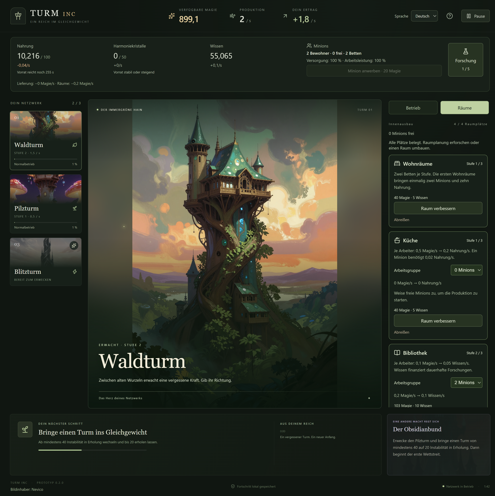
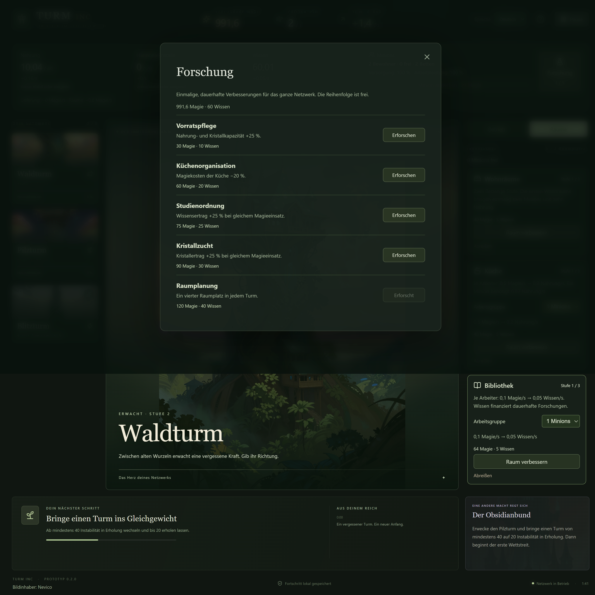
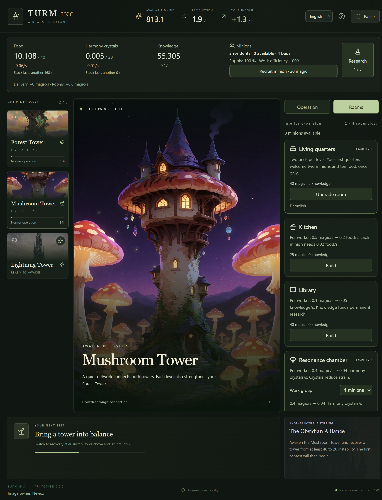

# Prüfbericht – Turm INC v0.2.0

Stand: 5. Oktober 2026. Bewohner, Räume und Ressourcen ergänzen den Windows-x64-Prototyp. Verbindliche Regeln: [Erweiterung v0.2](11-bewohner-und-raeume.md).

## Ergebnis

- TypeScript-Prüfung erfolgreich.
- 55 automatisierte Regel-, Wirtschafts-, Speicher- und Lokalisierungstests erfolgreich.
- Sechs Desktop-Szenarien gegen die gepackte Anwendung erfolgreich; isolierte temporäre Spielstände, keine Änderungen an echtem Nutzerfortschritt.
- Deutsche und englische Raum-, Ressourcen- und Forschungsansichten visuell geprüft, einschließlich kleinem Fenster.
- Vorhandene Bilder bleiben unverändert. Bildinhaber: **Nevico**, im Spiel und in der Hilfe genannt.

## Neue Wirtschaft und bestehende Regeln

Geprüft sind Freischaltungen, Raumgrenzen, einmaliges Bewohnergeschenk, Anwerbung, eindeutige Arbeitszuweisung, Raumkosten, Forschungskosten und -wirkungen, belegte Arbeitsplätze, bestätigter Abriss und Erstattung tatsächlich bezahlter Magie. Fehlende Betten und reduzierte Lagerkapazitäten entfernen keine Bewohner oder Vorräte.

Mengenbilanzen prüfen Magieverbrauch, Nahrung, Wissen, Kristalle und Auftragserträge gemeinsam. Knappe Magie, verbleibende Lagerplätze und Kristalle werden proportional verteilt. Nahrungsknappheit senkt die Arbeit bis auf 25 %; eine besetzte Küche stellt die Versorgung wieder her. Keine kostenlose Mehrfachforschung und kein mehrfaches Geschenk durch Abriss und Neubau.

Stabilisierung baut keine Instabilität ab, lässt Hochleistung belastend und verbraucht bei Erholung keine Kristalle. Nach Abriss des letzten Resonanzraums bleibt die Auswahl erhalten; Verbrauch wartet auf Neubau. Raumproduktion und Resonanz ergeben bei verschiedenen Darstellungsintervallen identische Zustände. Pause stoppt die gesamte Wirtschaft und sperrt Änderungen.

Die bestehenden Tests für Turmproduktion, Pilzbonus, Instabilitätsgrenzen, Modusbindung, bewusste Erholung und Kaufregeln bestehen weiterhin. Aktives Management übertrifft unbeaufsichtigten Normalbetrieb im ursprünglichen Zehn-Minuten-Vergleich um mindestens 30 %. Auftragsabschluss innerhalb eines Schritts, Sieg, Niederlage, Gleichstand, Ablauf und einmalige Prämie bleiben geprüft.

## Vollständiger v0.2-Durchlauf

Ein automatisierter Durchlauf ohne geschenkte Testressourcen schließt die erweiterte Einführung nach **1.148 aktiven Sekunden (19:08 Minuten)** ab. Er erreicht drei aktive Türme, drei Bewohner, eine besetzte Küche, Bibliothek und Resonanzraum, eine Forschung, tatsächlich versorgte Kristallstabilisierung, bewusste Erholung und fünf entschiedene Aufträge. Versorgung am Ende: 100 %. Betriebswechsel: 46.

Die Strategie nutzt im Wald Wohnräume, Küche und Bibliothek; im Pilzturm Wohnräume und Resonanzraum. Je ein Minion betreibt Küche, Bibliothek und Resonanzraum. Aufträge werden dabei nicht beliefert; verlorene Aufträge verhindern den Ausbau nicht. Dies belegt Erreichbarkeit einer konkreten Strategie, keine optimale Spielweise.

## Desktop und Kompatibilität

1. Frischer Start, Aktivierung, Hochleistung, Modusbindung, lokale Bilder ohne Netzwerk, tatsächlicher Fensterfokuswechsel, Minimieren, Suspendierungssignal und Wiederöffnen ohne Offline-Ertrag.
2. Netzwerk und Auftrag, Lieferquote, Turmauswahl und kleines Fenster. Ein echter Speicherfehler wird sichtbar; erneutes Speichern funktioniert nach Behebung.
3. Beschädigte Hauptdatei mit gültiger Sicherung: verständlicher Hinweis, ausdrückliches Fortsetzen und Archivierung der defekten Datei.
4. Zweiter Programmstart verwendet die vorhandene Instanz und überschreibt keinen Spielstand.
5. Deutsch/Englisch in Spiel, Pause und Hilfe; Zahlenformate, alte Chroniktexte und native Neustart-Bestätigung. Sprache überlebt neue Spiele und Wiederöffnen. Fehler beim Speichern der Sprache werden angezeigt.
6. Räume bauen, Arbeitsgruppen zuweisen und umverteilen, Raumplanung erforschen, vierten Platz nutzen, Raum verbessern, Abriss abbrechen und bestätigen, Minion anwerben, Kristalle erzeugen und Stabilisierung wählen. Englisch im kleinen Fenster; vollständige Pause und Wiederherstellung der Raumwirtschaft nach Neustart.

Speicherversionen 1 und 2 werden zu Version 3 übernommen. Bestehende Magie, Gesamtproduktion, Zeiten, Modusbindung und Wettbewerb bleiben erhalten. Neue Ressourcen und Bevölkerung starten leer. Laden verändert die alte Datei nicht; reguläres Speichern bewahrt sie als Sicherung. Ungültige Raum-, Arbeiter- und Erstattungsdaten werden abgelehnt.

## Ansichten







## Auslieferung

- Anwendung: `out/Turm INC-win32-x64/Turm INC.exe`.
- Paket: `out/make/zip/win32/x64/Turm-INC-0.2.0-win32-x64.zip`.
- Das ZIP vollständig entpacken und die EXE im entpackten Verzeichnis starten. Laufzeit und Bilder sind enthalten; kein Entwicklungsserver oder Netzwerk erforderlich.
- Spielstände liegen weiterhin im Anwendungsdatenverzeichnis von Turm INC; die Sprachwahl bleibt separat erhalten.

ZIP-Integritätsprüfung erfolgreich: 73 Einträge, 158.6 MiB. SHA256: `54dc2fc3cb94cf7842c160a782028c867a6465ceb6a550865d99187dfdd4cd31`.

## Balance und menschlicher Spieltest

Die freigegebenen Zahlen bleiben die Ausgangskonfiguration. Rund 19 Minuten sind ein automatisch erzielter Wert, keine gemessene menschliche Einführungszeit. Die Teststrategie benötigt bei drei Bewohnern nur eine dauerhaft besetzte Küche und keine wiederholte Arbeitsumverteilung. Daher ist insbesondere zu prüfen, ob größere Belegschaften, andere Raumverteilungen und gleichzeitige Auftragslieferungen genügend unterschiedliche Entscheidungen erzeugen.

Weitere Schwerpunkte sind Verständlichkeit, Wartezeiten bis zum Blitzturm und zur ersten Forschung, die Übersicht der neuen Ressourcen und das Verhältnis zwischen Kristallstabilisierung und manueller Erholung. Langfristige Balance und Spielspaß gelten durch diese Tests nicht als bestätigt. Zusätzliche Raumarten und neue Auftragsressourcen werden noch nicht eingeführt.

## Reproduzieren

```powershell
npm ci
npm run check
npm run make
npm run test:desktop
npm exec vitest -- run tests/economy.test.ts --disableConsoleIntercept
```
