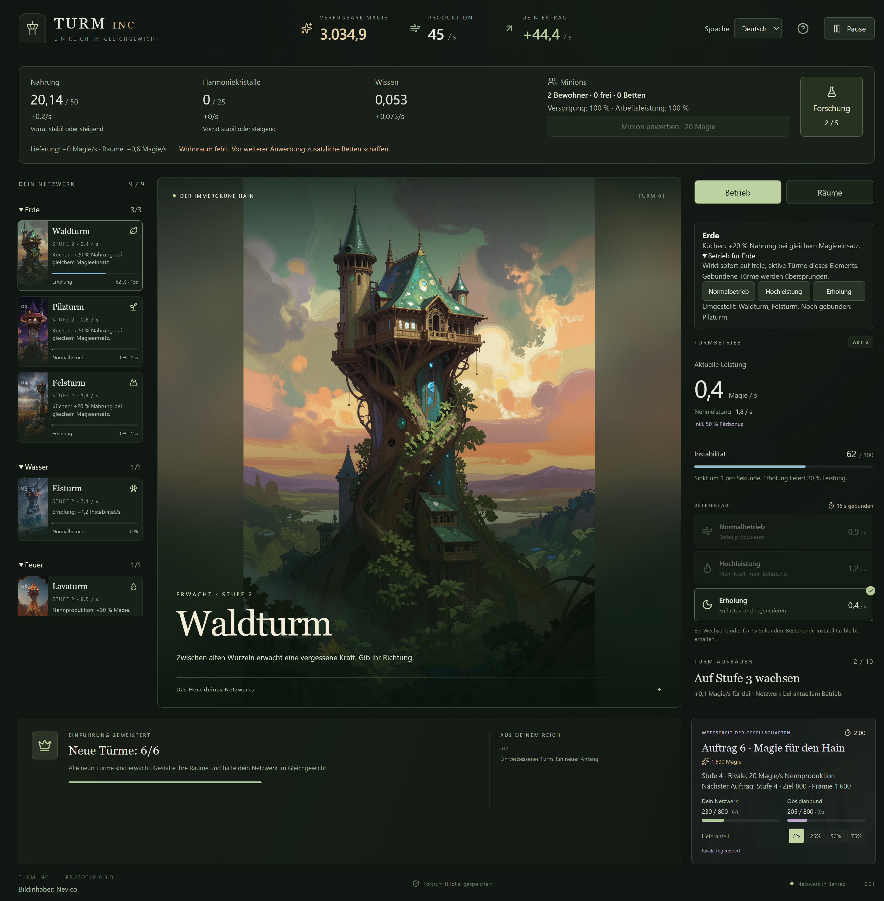
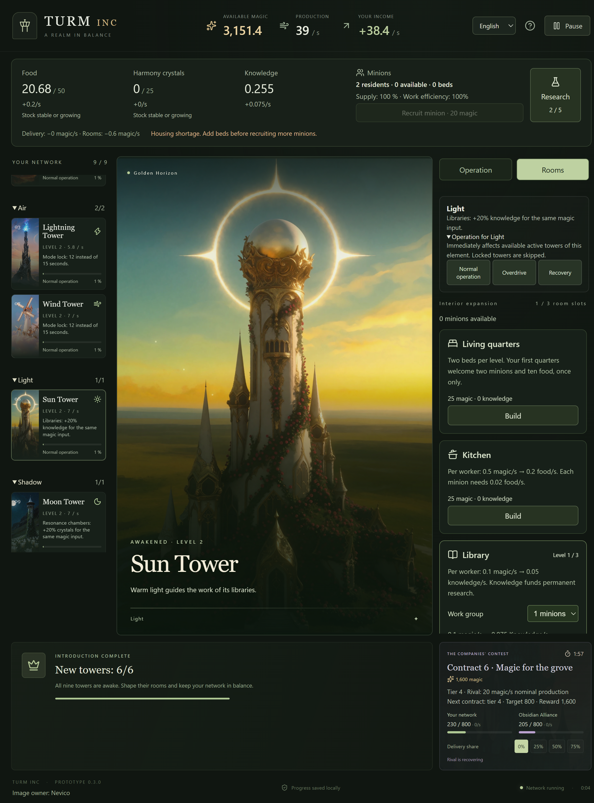

# Prüfbericht – Turm INC v0.3.0

Stand: 5. Oktober 2026. Verbindliche Regeln: [Sechs Elemente und neun Türme](12-elemente-und-tuerme.md). Historischer Vergleich: [Prüfbericht v0.2](09-pruefbericht-v02.md).

## Ergebnis

- TypeScript-Prüfung erfolgreich; 83 automatisierte Tests in sechs Testdateien bestanden.
- Acht Desktop-Szenarien gegen das fertig gepackte Windows-Programm bestanden. Ausschließlich isolierte temporäre Spielstände; kein echter Nutzerfortschritt verändert.
- Drei komplette Durchläufe ohne geschenkte Ressourcen erreichen alle neun Türme nach 34–35 aktiven Minuten.
- Deutsche und englische Ansichten visuell geprüft; kompakte aufklappbare Turmkarten, lokale Boni, Gruppenbedienung und kleine Fenster (angeforderte native Größe 1080×760).
- Alle zehn verwendeten Bilder sind bytegleich zu den Originalen und auch innerhalb von app.asar geprüft. Bildinhaber **Nevico** bleibt in Oberfläche, Hilfe und Dokumentation genannt.

## Regeln, Wirtschaft und Migration

Geprüft sind die bisherige Einführung unabhängig von der erweiterten Turmliste, dauerhafte Freigabe, zwei gegensätzliche Erweckungsreihenfolgen und die exakten Preise 600 / 960 / 1.536 / 2.458 / 3.933 / 6.292. Eine Gleitkomma-Ungenauigkeit beim Aufrunden des dritten Preises wurde durch den Test gefunden und behoben. Fehlgeschlagene Erweckungen erhöhen keine Preise.

Elementtests prüfen lokale Küchen-, Wissens- und Kristallboni, multiplikative Forschung, Lava-Nennproduktion, Wasser-Erholung und Luft-Bindung. Gruppenbefehle überspringen gebundene Türme, setzen keinen Zustand zurück und führen keine spätere Automatik aus. Pause sperrt auch Gruppenbefehle. Neun aktive Türme ergeben bei unterschiedlichen Darstellungsintervallen identische Simulationsergebnisse.

Bestehende Wirtschaftsprüfungen für Bau, Raumverbesserungen, Anwerbung, Arbeitszuweisung, Forschung, Versorgung, Abriss und Speichergrenzen bestehen weiterhin. Zusätzliche Neun-Turm-Prüfungen decken knappe Magie, proportionale Kristallverteilung unabhängig von der Reihenfolge der Zustandskarten und die Grenze von 54 Bewohnern ab. Volle Ziellager stoppen die zugehörigen Einsätze. Grundmagieproduktion bleibt erhalten.

Jede der vier Konkurrenzstufen ist mit Sieg, Niederlage, Gleichstand und Ablauf geprüft. Mengenbilanz einschließlich Überschuss nach Abschluss und einmaliger Prämie stimmt. Laufende Aufträge bewahren ihre Werte bei Erweckungen; erst der nächste Auftrag übernimmt die höhere Stufe. Ergebnisse behalten historische Ziele und Prämien. Der ursprüngliche Zehn-Minuten-Vergleich bestätigt weiterhin mindestens 30 % Vorteil durch aktives Management.

Migrationen verwenden tatsächliche alte Formate der Speicherversionen 1, 2 und 3. Guthaben, Räume, Minions, Forschungen, laufende Aufträge und Bindungen bleiben erhalten; insbesondere wird eine bestehende Luftturm-Bindung nicht verkürzt. Neue Türme sind inaktiv und leer. Abgeschlossene v0.2-Einführungen geben die Erweiterung frei. Alte Auftragsmeldungen werden mit ihren ursprünglichen Werten lokalisiert. Beschädigte Daten werden vor der Erweiterung abgelehnt. Laden lässt die Quelldatei unverändert; Speichern bewahrt die gültige alte Fassung als Sicherung.

## Vollständige Durchläufe und Balancebeobachtungen

Alle drei Durchläufe starten mit null Magie, erwecken Wald, verbessern ihn auf Stufe 2 und bauen ihre Wirtschaft ausschließlich mit regulären Aktionen auf. Drei Bewohner betreiben je eine Küche, Bibliothek und einen Resonanzraum. Der Test wechselt einzelne Türme bei 60 Instabilität in Erholung und bei 20 zurück in Hochleistung. Es werden keine Aufträge beliefert; Niederlagen verhindern die Freischaltungen nicht. Die Strategien kaufen neue Türme auf Stufe 1 und optimieren nicht zusätzlich deren Verbesserungen.

Die v0.2-Einführung mit den neuen Elementboni endet bei allen Routen nach **1.083,4 Sekunden (18:03)**. Die längste Wartezeit auf eine gewünschte Anschaffung beträgt **570,2 Sekunden vor dem Blitzturm**; währenddessen werden weiterhin Betriebswechsel ausgeführt. Der erste Erweiterungsturm wird bei 1.209,5 Sekunden erweckt.

| Route | Reihenfolge neuer Türme | Alle neun aktiv | Wechsel im gesamten Test | Wechsel im abschließenden 600-s-Fenster | Wissen in diesem Fenster |
| --- | --- | ---: | ---: | ---: | ---: |
| Produktion zuerst, spezialisierte Räume | Lava, Sonne, Mond, Eis, Wind, Fels | 2.040,8 s (34:01) | 322 | 133 | 45 |
| Erde zuerst, spezialisierte Räume | Fels, Eis, Wind, Mond, Sonne, Lava | 2.075,9 s (34:36) | 328 | 134 | 45 |
| Andere Reihenfolge, gemischte Räume | Mond, Sonne, Wind, Lava, Eis, Fels | 2.062,3 s (34:22) | 325 | 134 | 37,5 |

Nach der neunten Erweckung verlegen die spezialisierten Routen Küche nach Fels, Bibliothek nach Sonne und Resonanzraum nach Mond. Die gemischte Route verwendet Lava, Eis und Wind. Alle drei kaufen Studienordnung und Kristallzucht über regulär erarbeitetes Wissen. Die folgende gleich lange Beobachtung bestätigt 20 % zusätzlichen Wissensertrag im Sonnenturm. Die Versorgung liegt am Ende immer bei 100 %. Pro Route werden 15 Aufträge entschieden; mittlere gemessene Auftragsdauer rund 93 aktive Sekunden (Aufzeichnung in 100-ms-Schritten).

**Grenzen:** Dies belegt Erreichbarkeit und die vorgesehenen lokalen Effekte, keine optimale Strategie oder menschliche Spielzeit. Die Wechselhäufigkeit von 133–134 Einzelwechseln in zehn Minuten entspricht ungefähr einem Wechsel alle 4,5 Sekunden. Elementbefehle können mehrere davon bündeln; ihre reale Entlastung wurde funktional, aber noch nicht durch menschliche Spieltests bewertet. Drei Bewohner genügen in diesen Routen; wiederholte Arbeitsumverteilung ist nicht erforderlich. Die lange frühe Wartephase, das knappe Zeitgefälle zwischen Kaufreihenfolgen und die Tendenz zu fest spezialisierten Räumen bleiben Schwerpunkte für den nächsten Spieltest. Die vorgegebenen Balancewerte wurden deshalb nicht eigenmächtig verändert.

## Desktop-Szenarien

1. Frischer Offline-Start, Erweckung, Produktion, Modusbindung, tatsächlicher Fokuswechsel, Minimieren, Suspendierungssignal und Wiederöffnen ohne Offline-Ertrag.
2. Auftragssteuerung, Turmauswahl und kleine Fenster; ein echter Speicherfehler wird sichtbar und kann nach Behebung erneut gespeichert werden.
3. Beschädigte Hauptdatei, verständlicher Hinweis, ausdrückliche Wiederaufnahme der Sicherung und Archivierung der defekten Datei.
4. Ein zweiter Programmstart verwendet die bestehende Instanz und verändert keinen Spielstand.
5. Sprachwechsel in Spiel, Pause und Hilfe; historische v1-Texte, Zahlenformate, dauerhafte Sprachwahl sowie Fehler beim Speichern der Sprache.
6. Raumwirtschaft: Bauen, Arbeitsgruppen, Forschung, vierter Platz, Raumverbesserung, bestätigter/abgebrochener Abriss, Anwerbung, Kristallerzeugung und Stabilisierung; Neustart erhält den Zustand.
7. Alle neun Türme, Auf-/Zuklappen einer Elementgruppe per Tastatur, Gruppen-Erholung mit gebundenem Pilzturm, alle sechs neuen Bildansichten, Wasserbonus, Stufe-4-Auftrag und englische Räume bei kleiner Fenstergröße. Pause und Neustart bewahren Türme, Wirtschaft und Auftragsregeln.
8. Tatsächliche v0.2-Migration im gepackten Programm; danach freie Wahl des Mondturms als erste Erweiterung und korrekter nächster Preis von 960 Magie.

## Ansichten





Die Screenshots stammen aus Desktop-Testständen mit vorbereiteten Zuständen; sie sind keine Belege für den ressourcenfreien Start. Dieser wird getrennt in den vollständigen Durchläufen geprüft.

## Auslieferung

- Anwendung: `out/Turm INC-win32-x64/Turm INC.exe`.
- Paket: `out/make/zip/win32/x64/Turm-INC-0.3.0-win32-x64.zip`.
- ZIP vollständig entpacken und die enthaltene EXE starten. Laufzeit und Bilder sind enthalten. Kein Netzwerk und kein Entwicklungsserver erforderlich.
- ZIP-Integrität einschließlich CRC geprüft: **73 Einträge, 165,0 MiB**. Das enthaltene app.asar ist bytegleich mit dem gegen Desktop-Tests geprüften Paket.
- SHA256: `3a8b56c9232bd9a56032fb37977e6d36347ded9bfa12b4dbe13a721b1fbdf35b`.

## Reproduzieren

```powershell
npm ci
npm run check
npm run make
npm run test:desktop
npm exec vitest -- run tests/expansion-playthrough.test.ts --disableConsoleIntercept
```

Der Quellcode wird im öffentlichen Repository [OnekoSL/turm-inc](https://github.com/OnekoSL/turm-inc) gepflegt. Das geprüfte Windows-Paket liegt lokal bereit; ein GitHub-Release mit ZIP-Download ist separat zu veröffentlichen.
