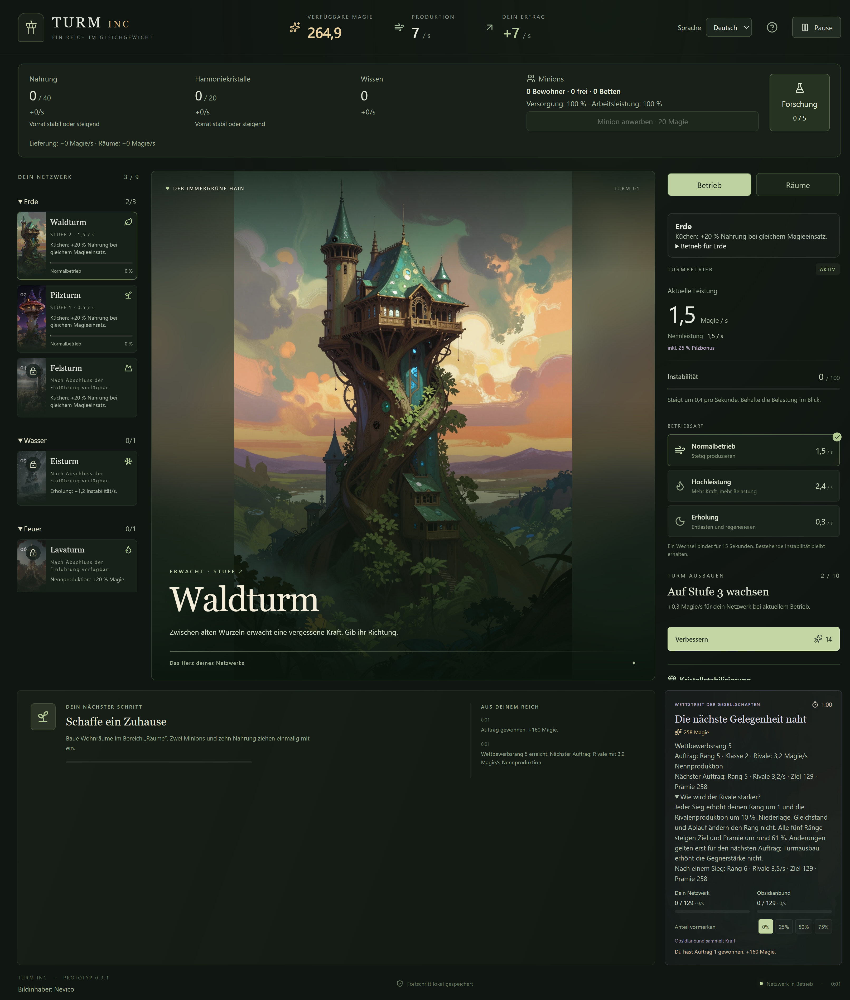
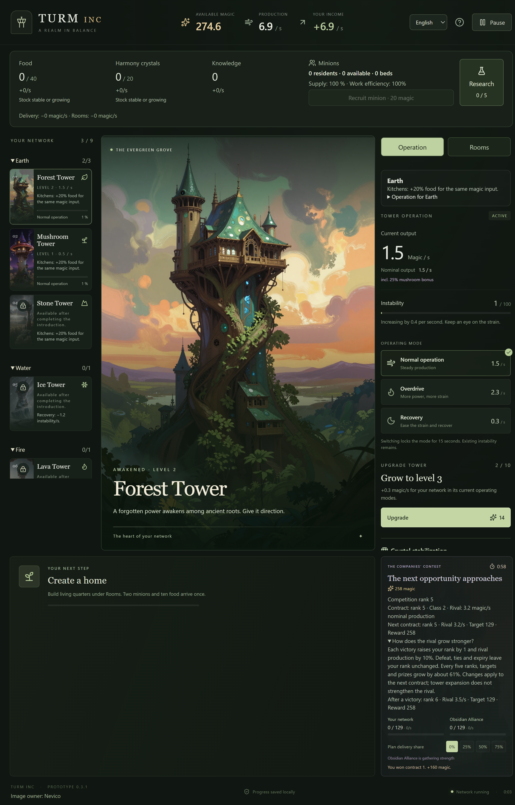

# Prüfbericht – Turm INC v0.3.1

Stand: 5. Oktober 2026. Änderung: [Wettbewerbsrang](13-wettbewerbsrang.md) ersetzt Gegnersteigerung nach Turmanzahl. Historische Berichte: [v0.3.0](09-pruefbericht-v03.md) und [v0.2](09-pruefbericht-v02.md).

## Ergebnis

- TypeScript-Prüfung erfolgreich, **116 automatisierte Tests** in sieben Testdateien bestanden.
- **Neun Desktop-Szenarien** gegen das paketierte Windows-Programm bestanden; ausschließlich isolierte Testspielstände.
- Deutsche und englische Ranganzeige samt Erklärung und Vorschau visuell geprüft, auch bei angeforderter Fenstergröße 1080×760.
- Alle bisherigen Regeltests für neun Türme, Elemente, Raumwirtschaft, Versorgung, Pause und lokale Speicherung bestehen weiterhin.

## Neue Prüfungen

33 neue Fälle prüfen exponentiell 10 % stärkere Rivalenproduktion pro Sieg; unveränderte Werte innerhalb einer Größenklasse; Ziel/Prämie an den Fünfergrenzen; Siege, Niederlagen, Gleichstände und Ablauf auf Rang 0, 4, 5, 9, 10 und 25; exakte Mengenbilanz und einmalige Auszahlung/Rangerhöhung; Übernahme der neuen Regeln erst beim nächsten Auftrag; keine zusätzliche Steigerung durch Turmbau oder Verbesserungen; Pause und identischer Fortschritt bei verschiedenen Darstellungsraten.

Migrationen der bisherigen Spielstände bleiben geprüft. Vier zusätzliche Szenarien übernehmen jede alte Konkurrenzklasse unverändert für den laufenden Auftrag. Der Startrang 0/12/19/25 übernimmt die bisherige Nennproduktion 2/6/12/20 Magie/s in die neue Fortschrittskurve. Ursprüngliche Quelldatei und Sicherung bleiben erhalten. Neuladen nach einem Sieg erhöht den Rang nicht erneut. Manipulierte Auftragsregeln, ungültige Ränge und numerisch nicht darstellbare Regeln werden abgelehnt.

Das zusätzliche Desktop-Szenario startet unmittelbar vor einem Sieg auf Rang 4. Es bestätigt Rang 5, weiterhin 160 Magie für den abgeschlossenen Auftrag und anschließend Ziel 129/Prämie 258. Sprachwechsel zeigt dieselben Werte in Englisch; Pause und erneutes Öffnen erhalten Rang, Guthaben und Auftragszustand. Die früheren acht Desktop-Szenarien prüfen weiterhin Offline-Start, Bilder, Fokusverlust, Minimieren, Suspendierungssignal, Speicherfehler, Sicherungswiederherstellung, Einzelinstanz, Sprachen, Räume und alle neun Türme.

## Kontrollierter Belastungstest

Ein vorbereitetes, unverändertes Netzwerk mit Wald Stufe 2, Pilz Stufe 1 und Blitz Stufe 1 spielt 40 Aufträge. Lieferquote 75 %, Erholung ab 60 Instabilität und Rückkehr zur Hochleistung bei höchstens 20; keine weiteren Turmverbesserungen oder Erweckungen.

Ergebnis nach **4.051,3 aktiven Sekunden**: **14 Siege, 26 Niederlagen, Rang 14**, danach **7,595 Magie/s** Rivalen-Nennproduktion. Der Gegner ist für diese feste Strategie nicht mehr dauerhaft leicht zu besiegen. Das ist ein gezielter Simulationstest mit vorbereitetem Zustand, kein ressourcenfreier Spieldurchlauf und kein menschliches Balanceurteil. Die drei bestehenden vollständigen Neun-Turm-Durchläufe ohne Ressourcenhilfen bestehen zusätzlich weiterhin; ohne Siege bleibt ihr Rang wie vorgesehen bei 0.

## Ansichten





## Windows-Paket

- Programm: `out/Turm INC-win32-x64/Turm INC.exe`.
- ZIP: `out/make/zip/win32/x64/Turm-INC-0.3.1-win32-x64.zip`.
- ZIP vollständig entpacken, anschließend `Turm INC/Turm INC.exe` starten.
- **73 Einträge, 165,0 MiB**; CRC-Integrität erfolgreich geprüft. Das enthaltene app.asar ist bytegleich zum getesteten Programm. Kein Entwicklungsserver oder Netzwerk zum Spielen erforderlich.
- SHA256: `2a99a1e538c70b961c3e0788836b5bfa61523e0deec90b2a9aa35a1c8d6617bf`.
- Speicherversion 5, Balanceversion 3; Spielstände der Versionen 1–4 werden übernommen.
- Das geprüfte Paket steht als separates [GitHub-Release v0.3.1](https://github.com/OnekoSL/turm-inc/releases/tag/v0.3.1) bereit. Das ältere Release v0.3.0 bleibt verfügbar.

Bildinhaber bleibt **Nevico**. Originale und Spielbilder wurden nicht verändert.

```powershell
npm run check
npm run make
npm run test:desktop
npm exec vitest -- run tests/competition-rank.test.ts --disableConsoleIntercept
```
