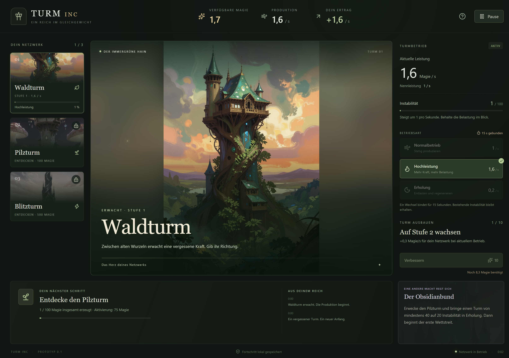
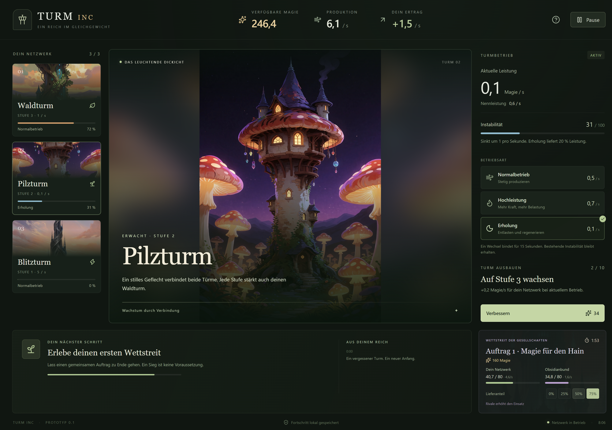
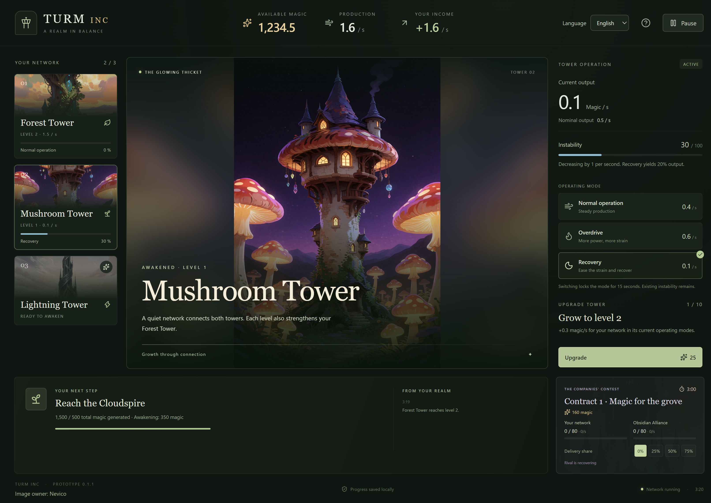

# Prüfbericht – Turm INC v0.1.1

Stand: 4. Oktober 2026. Windows-x64-Prototyp implementiert und paketiert.

## Ergebnis

- TypeScript-Prüfung erfolgreich.
- 39 Regel-, Speicher- und Lokalisierungstests erfolgreich.
- Fünf automatisierte Desktop-Szenarien gegen die gepackte Anwendung erfolgreich.
- ZIP-Integritätsprüfung erfolgreich: 73 Einträge, rund 158,6 MiB.
- Vier eingebundene Turmbilder stimmen bytegenau mit den vorhandenen Originaldateien überein. Die 33 Originalbilder wurden nicht verändert.

## Geprüfte Spielregeln

Aktivierung und Entdeckung, exakt bezahlbare Käufe, abgewiesene Käufe, Stufenobergrenze, Pilzbonus, 15 Sekunden Modusbindung, kontinuierliche bewusste Erholung, Instabilitätsgrenzen und Restproduktion. Gleiche Zeitschritte bei unterschiedlichen Darstellungsintervallen liefern identische Ergebnisse. Produktion wird bei Verbesserungen nicht rückwirkend geändert.

Lieferung und Guthaben zählen erzeugte Magie nicht doppelt. Sieg innerhalb eines Schritts, Niederlage, Gleichstand, Ablauf, Abklingphase, erneuter Auftrag und einmalige Prämienauszahlung sind geprüft. Rivalenstrategie reagiert auf Rückstand und beachtet Erholungsgrenzen. Während Pause verändert sich keine Seite.

Im Zehn-Minuten-Vergleich übertrifft bewusstes Steuern unbeaufsichtigten Normalbetrieb um mehr als die geforderten 30 %.

## Vollständiger Ablauf

Ein automatisierter Durchlauf über normale Spielaktionen und ohne geschenktes Guthaben schließt die Einführung nach rund **341 aktiven Sekunden (5:41 Minuten)** ab. Er hat dann drei aktive Türme, eine abgeschlossene bewusste Erholung und zwei entschiedene Aufträge. Dabei wurden 15 Betriebswechsel ausgeführt; der längste Abstand zwischen wirksamen Aktionen lag bei 45,3 Sekunden.

Dies ist eine reproduzierbare Regelprüfung, keine gemessene menschliche Spielzeit. Die Strategie kennt bereits Regeln und Ziele und entscheidet unmittelbar. Die Zahlen belegen Erreichbarkeit und einen aktiven Rhythmus, nicht langfristigen Spielspaß oder optimale Balance.

## Desktop-Prüfung

Die Tests verwenden eigene temporäre Spielstände und verändern keinen echten Nutzerfortschritt.

1. Frischer Start, Fortsetzen, kostenlose Aktivierung, Hochleistung und Modusbindung; lokale Bilder laden bei offline geschaltetem Browserkontext. Fokusverlust, Minimieren und ein simuliertes Systemsuspendierungssignal pausieren. Wiederöffnen behält Guthaben, Turmzustände, Zeit und Wettbewerb ohne Offline-Fortschritt.
2. Ein vorbereiteter Netzwerkzustand zeigt alle Türme und einen laufenden Auftrag. Auswahl und Lieferquote funktionieren. Kleine Fenster erzeugen kein horizontales Scrollen. Ein tatsächlicher Dateisystemfehler wird sichtbar gemeldet; erneutes Speichern funktioniert nach Behebung.
3. Eine beschädigte Hauptdatei wird erklärt. Die Sicherung lässt sich ausdrücklich fortsetzen, während die beschädigte Datei archiviert erhalten bleibt.
4. Ein zweiter Programmstart beendet seine zusätzliche Instanz, verwendet das bestehende Fenster und überschreibt keinen Spielstand.

5. Sprachwechsel Deutsch/Englisch im pausierten und laufenden Spiel sowie in der Hilfe. Der pausierte Spielzustand bleibt exakt gleich. Zahlenformatierung, alte Chroniktexte, Erholung, Auftrag, Pausegrund und native Neustart-Bestätigung wechseln mit. Ein tatsächlicher Schreibfehler der Spracheinstellung wird angezeigt. Neues Spiel und erneuter Programmstart behalten Englisch. Der Test bestätigt den nativen Dialog über eine kontrollierte Antwort im Testprozess.

Die Screenshots wurden visuell geprüft. Ein zunächst überlagerter Ausbauknopf bei Windows-Skalierung wurde durch inhaltsabhängige Rasterzeilen behoben. Die große Turmansicht zeigt das vollständige Bild vor einer unscharfen Erweiterung desselben Motivs.





## Mehrsprachigkeit

Katalogschlüssel und Parameter sind vollständig abgeglichen. Verschachtelte Turmnamen und deutsche/englische Zahlenformate sind geprüft. Version-1-Spielstände werden ohne Änderung der Wirtschaft übernommen; die Originaldatei bleibt bis zum regulären Speichern unverändert und danach als Sicherung erhalten. Fehlerhafte Meldungsdaten werden abgelehnt. Spracheinstellungen überleben neue Spiele, ungültige Einstellungen werden vor einer neuen Wahl archiviert. Englische Ansichten wurden bei normaler und kleiner Fenstergröße visuell geprüft.



Weitere Sprachen können über die [Lokalisierungsstruktur](10-mehrsprachigkeit.md) ergänzt werden.

## Bildnachweis

Bildinhaber: **Nevico**. Der Name wird in der Fußzeile und in der Spielhilfe genannt, auf Deutsch und Englisch. Das Windows-Paket enthält diese Ergänzung.

## Auslieferung

- Startbare Anwendung: `out/Turm INC-win32-x64/Turm INC.exe`.
- Vollständig entpackbares Paket: `out/make/zip/win32/x64/Turm-INC-0.1.1-win32-x64.zip`.
- ZIP-SHA256: `130d29377f8cfaacf8ef1781c5537b1cb095bd0f640be2feef33d6d869067ef8`.
- Das gesamte Verzeichnis beziehungsweise ZIP wird benötigt; die EXE nicht allein verschieben.
- Laufzeit, Oberfläche und Assets sind enthalten. Kein Entwicklungsserver, Benutzerkonto oder Netzwerk erforderlich.

## Bewusste Grenzen und nächster Spieltest

Die Betriebs- und Auftragswerte entsprechen der freigegebenen Anfangskonfiguration. Es gibt keine langfristige Rivalenentwicklung, weiteren Regionen oder variierenden Auftragsarten. Bei niedrigen Fensterhöhen ist vertikales Scrollen vorgesehen.

Menschlich zu prüfen sind Verständlichkeit ohne Erklärung, die Wahl zwischen Auftrag und Ausbau und die Abwechslung der Betriebsentscheidungen. Falls regelmäßiges Umschalten die einzige interessante Handlung bleibt, wird zuerst dieser Kern überarbeitet. Die vorhandenen automatisierten Tests behaupten keine abgeschlossene Spielspaßprüfung.

## Reproduzieren

```powershell
npm ci
npm run check
npm run make
npm run test:desktop
```

Für die Ablaufmessung mit sichtbarer Konsolenausgabe:

```powershell
npm exec vitest -- run tests/engine.test.ts --disableConsoleIntercept
```
